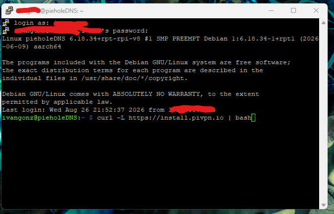
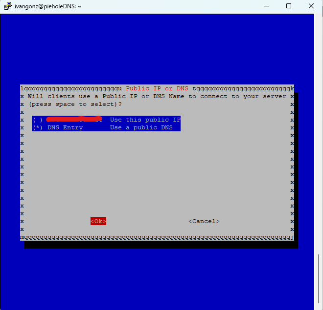
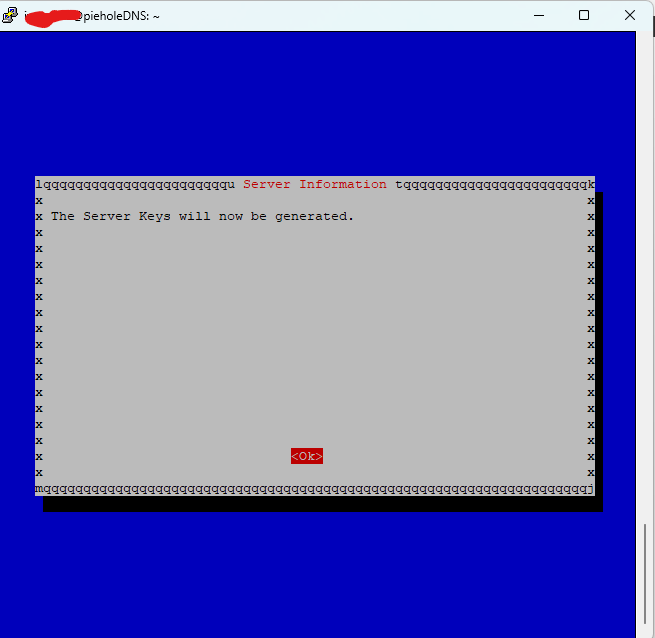
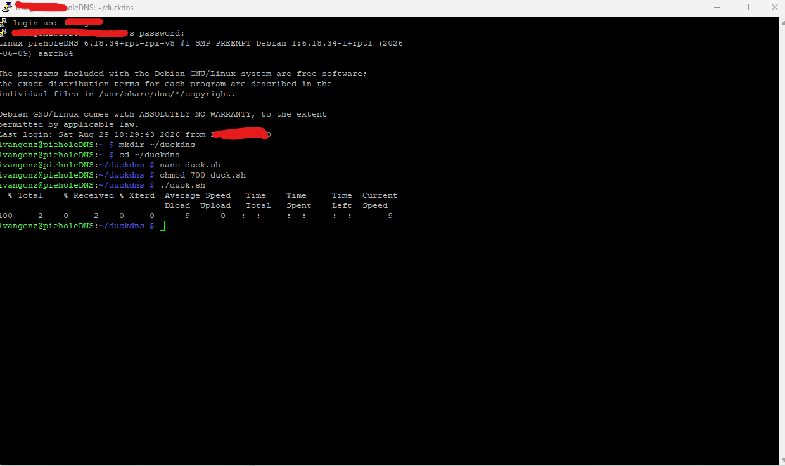
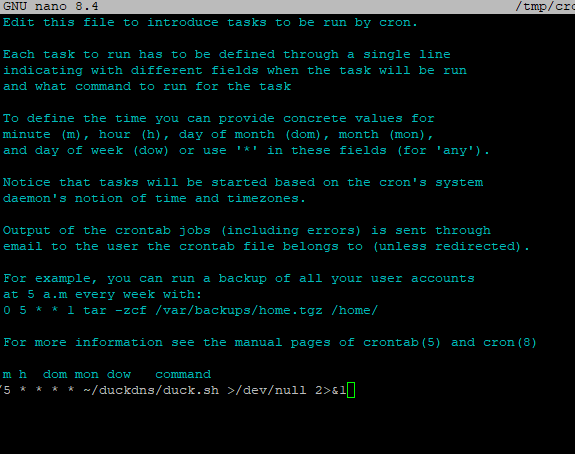
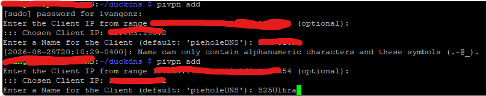
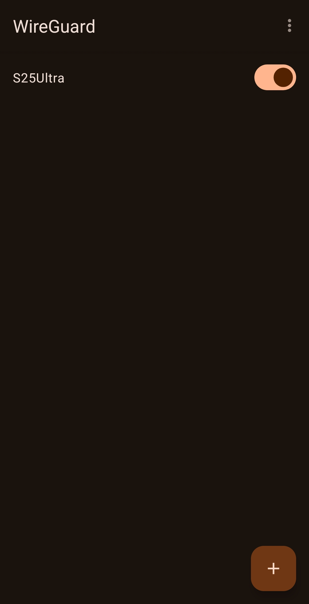
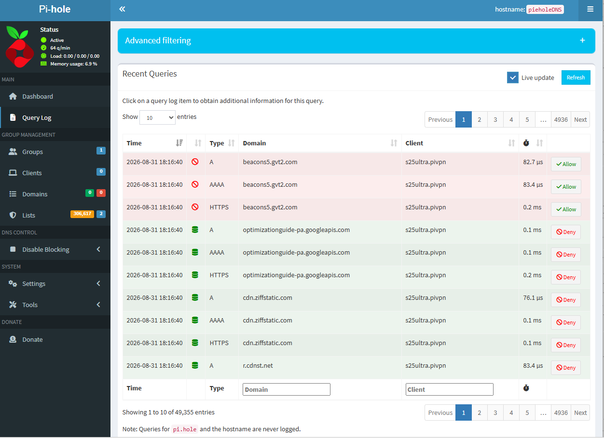

# Pi-hole + WireGuard VPN Home Lab

A self-hosted, network-wide ad-blocking DNS server built on a Raspberry Pi 4, extended with a WireGuard VPN so filtering and privacy protections follow mobile devices off the home network — not just on it.

## Overview

Most ad-blocking solutions only work on a single browser or device. This project applies filtering at the **network's DNS layer** instead, so every device on the network benefits automatically — and, via the VPN tunnel, that same protection extends to devices on cellular data anywhere in the world.

## Architecture

```
[Phone/Laptop, remote] --WireGuard tunnel--> [Home Router: UDP 51820 forwarded]
                                                        |
                                                        v
                                          [Raspberry Pi 4: Pi-hole + PiVPN]
                                                        |
                                                        v
                                              [Upstream DNS resolution]

[DuckDNS] <--cron job every 5 min-- [Raspberry Pi] (keeps hostname pointed at current public IP)
```

## Features

- **Network-wide ad/tracker blocking** via Pi-hole, using the Steven Black hosts blocklist
- **Encrypted remote access** via WireGuard, so filtering applies on cellular data, not just at home
- **Dynamic DNS** (DuckDNS) with an automated cron-based updater, so the VPN stays reachable even on a residential connection with a non-static public IP
- **Minimal attack surface** — only one UDP port is exposed to the internet, and only authenticated WireGuard traffic can pass through it
- **Automated patching** via `unattended-upgrades`, since the device has an internet-facing port

## Tech Stack

- Raspberry Pi 4 (Raspberry Pi OS Lite)
- Pi-hole (DNS-layer filtering)
- WireGuard / PiVPN (VPN tunnel)
- DuckDNS (Dynamic DNS)
- Netgear router (DHCP reservation + port forwarding)
- Bash / cron (automation)

## Setup Summary

1. Installed Pi-hole and subscribed it to a curated blocklist; ran `pihole -g` to compile it into an active gravity database.
2. Assigned the Pi a fixed local IP via router DHCP reservation.
3. Installed PiVPN with WireGuard as the VPN backend.
4. Registered a free DuckDNS hostname (handles a dynamic public IP) and wrote a small script + cron job to keep it updated every 5 minutes.
5. Forwarded a single UDP port (51820) on the router to the Pi.
6. Generated per-device WireGuard client profiles (`pivpn add`), distributed via QR code (mobile) or secure file transfer (desktop).
7. Validated end-to-end by disabling Wi-Fi on a test device, activating the VPN, and confirming ad/tracker domains were blocked in Pi-hole's Query Log while on cellular data.

*(Full step-by-step command reference kept separately as a personal runbook, not included here since it contains environment-specific values.)*

## Project in Action

**1. Installing PiVPN**
```bash
curl -L https://install.pivpn.io | bash
```

*PiVPN's installer being fetched and run directly over SSH.*

**2. Choosing Dynamic DNS over a static public IP**
Since residential ISP connections typically have a public IP that can change, "DNS Entry" was selected instead of hardcoding the current IP.

*Choosing a DNS hostname over a static public IP, to survive ISP IP changes.*

**3. Server key pair generation**
WireGuard generates its own public/private key pair to authenticate and encrypt the tunnel.

*PiVPN generating the server's WireGuard public/private key pair.*

**4. Setting up the DuckDNS updater script**
A small script keeps the DuckDNS hostname pointed at the current public IP.

*Writing and test-running the DuckDNS update script (`duck.sh`).*

**5. Scheduling the updater with cron**
```
*/5 * * * * ~/duckdns/duck.sh >/dev/null 2>&1
```

*Scheduling the DuckDNS updater to run every 5 minutes via cron.*

**6. Generating a per-device client profile**
```bash
pivpn add
```

*Creating a named WireGuard client profile with `pivpn add`.*

**7. Connected from a mobile device**

*The WireGuard tunnel active and connected on a mobile device, cellular data only.*

**8. Proof it works — filtering traffic over the VPN**
With Wi-Fi disabled and the VPN active, the client (`s25ultra.pivpn`) shows up in Pi-hole's Query Log with tracker/ad domains actively blocked (red) alongside legitimate traffic (green) — confirming the full chain (VPN → Pi-hole → filtering) works over cellular data, not just on the home network.

*Pi-hole's Query Log showing the VPN client's traffic being filtered live, over cellular data.*

## Security Considerations

- Attack surface intentionally minimized to a single authenticated, encrypted UDP port rather than exposing multiple services
- Automatic security patching enabled given the presence of an internet-facing port
- Planned hardening next steps: SSH key-based authentication (disabling password login), `fail2ban` for brute-force protection, and a UFW-based explicit firewall ruleset

## Skills Demonstrated

This project translates concepts studied for **CompTIA Security+ (SY0-701)** into a hands-on build:

| Area | Applied In This Project |
|---|---|
| Security Architecture | DNS-layer filtering, VPN-based secure remote access, minimal exposed attack surface |
| Threats, Vulnerabilities, and Mitigations | Attack surface reduction, planned brute-force mitigations |
| Security Operations | Automated patch management, log-based traffic validation |
| General Security Concepts | Asymmetric key generation and use (WireGuard key pairs) |
| Security Program Management | Project documentation and change tracking |

## Future Improvements

- [ ] SSH key-based authentication (disable password login)
- [ ] `fail2ban` for brute-force protection
- [ ] UFW firewall with explicit allow/deny rules
- [ ] Move WireGuard off its default port
- [ ] Add a monitoring/alerting layer for Pi-hole and PiVPN service health
